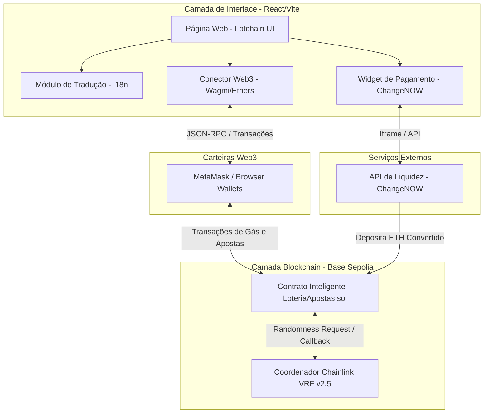
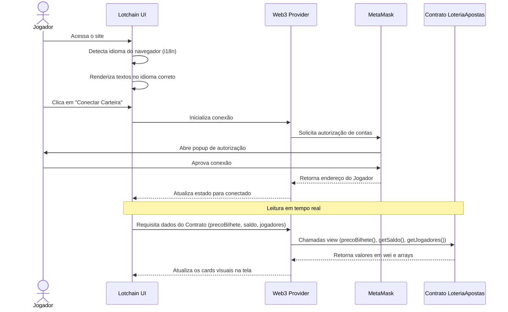
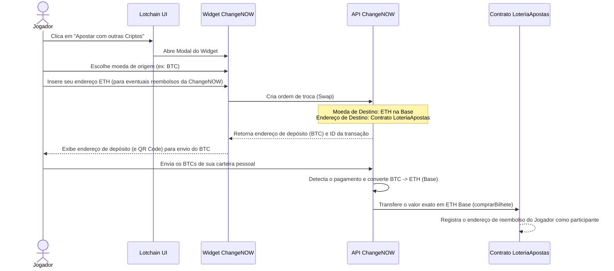

# Arquitetura do Frontend - Lotchain

Este documento descreve a arquitetura do sistema do frontend **Lotchain**, sua relação com a blockchain (Base Sepolia), com as carteiras web3 e com o integrador de pagamentos multi-cripto ChangeNOW.

---

## 1. Diagrama de Blocos Geral

---

## 2. Fluxos de Dados Principais

### 2.1 Conexão de Carteira e Leitura de Dados do Contrato

### 2.2 Compra de Bilhete com Conversão via ChangeNOW
Este fluxo descreve como um jogador que não possui ETH na rede Base pode apostar enviando outra moeda (ex: BTC, LTC ou USDT) via ChangeNOW.

---

## 3. Estado e Sincronização de Dados

O frontend se mantém atualizado através de dois mecanismos:
1. **Polling Actividade em Direto:** Uma chamada periódica (a cada 10 segundos) às funções view do contrato inteligente.
2. **Listeners de Eventos:** Escuta eventos emitidos pela blockchain para atualizar a tela instantaneamente assim que ocorrem:
   - `BilheteComprado(address jogador)`: Atualiza o contador de jogadores e o saldo do pool.
   - `SorteioIniciado(uint256 requestId)`: Altera o estado visual para "Sorteando..." e bloqueia o botão de apostas.
   - `VencedorSorteado(address vencedor, uint256 premio)`: Exibe um modal de parabéns, limpa a lista de jogadores e reabre o formulário de apostas.
